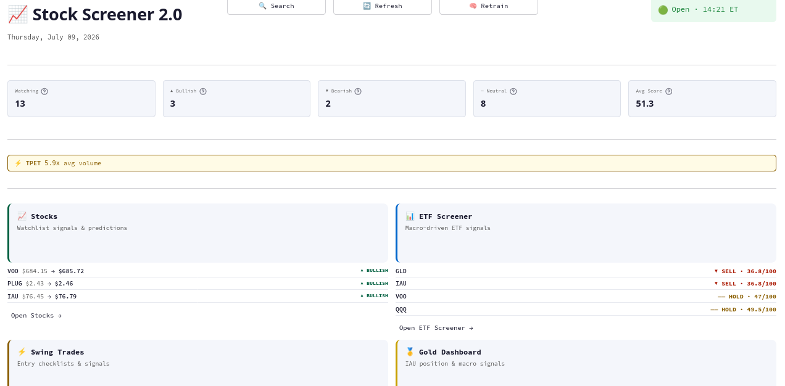
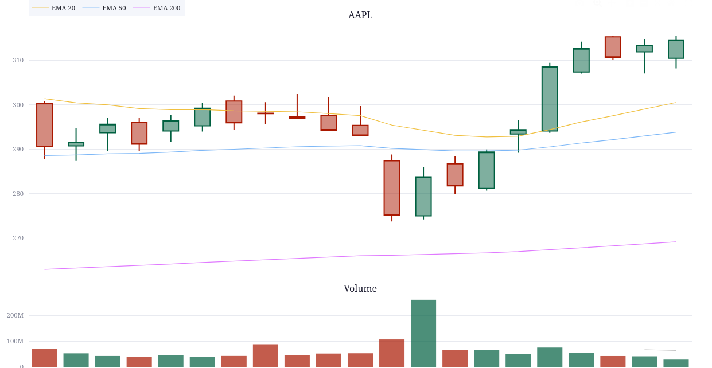
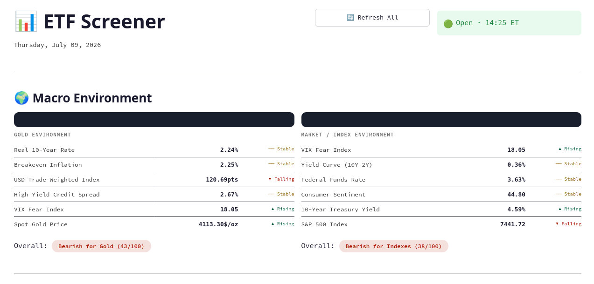
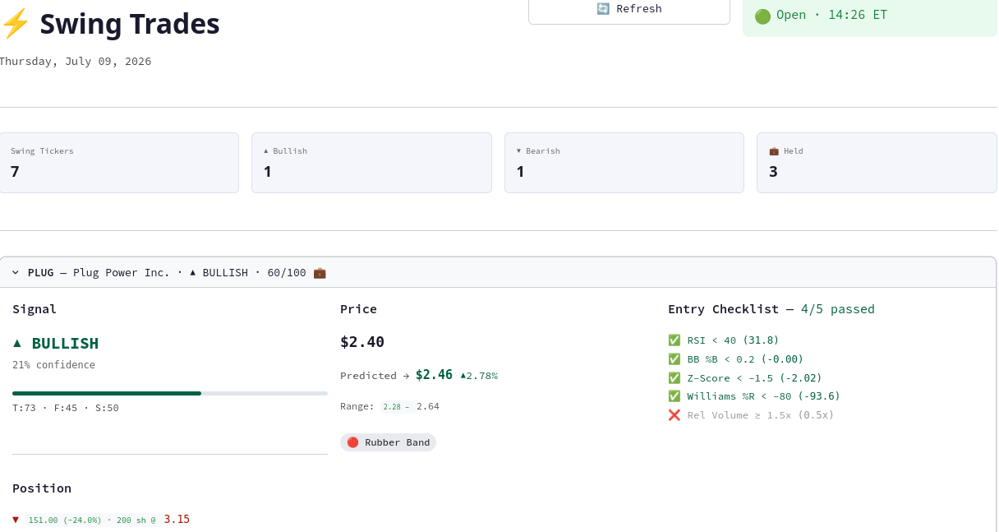
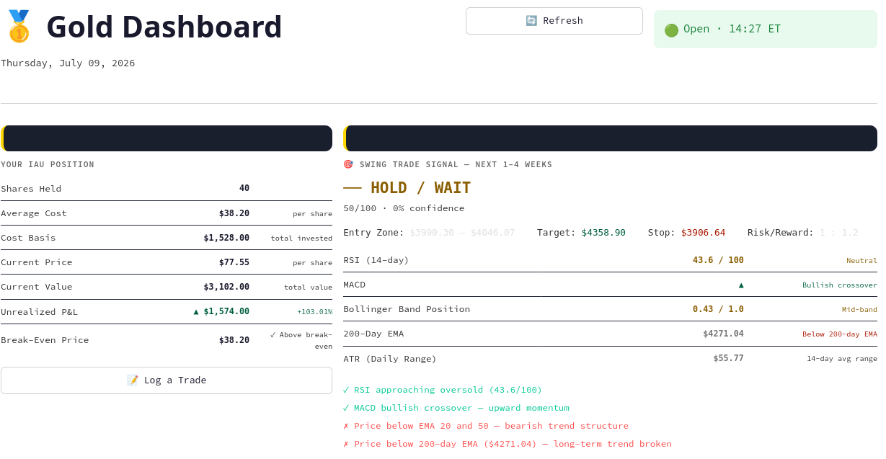
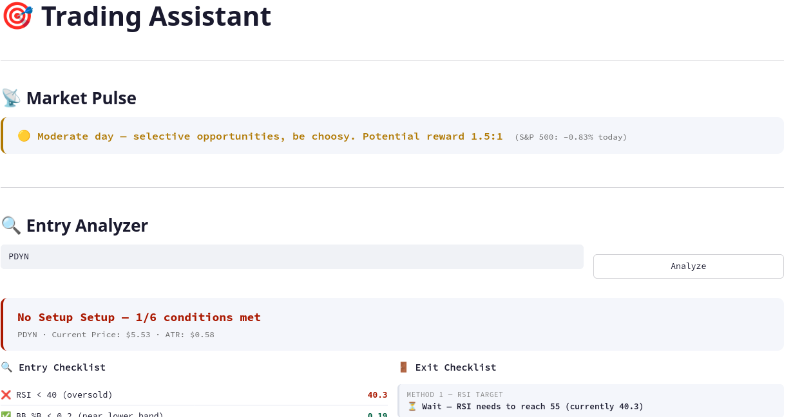
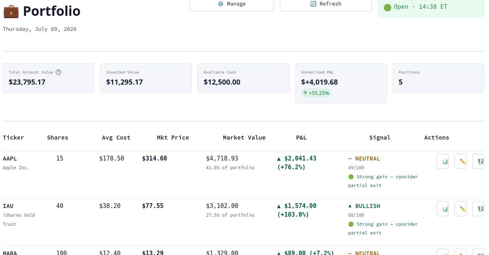
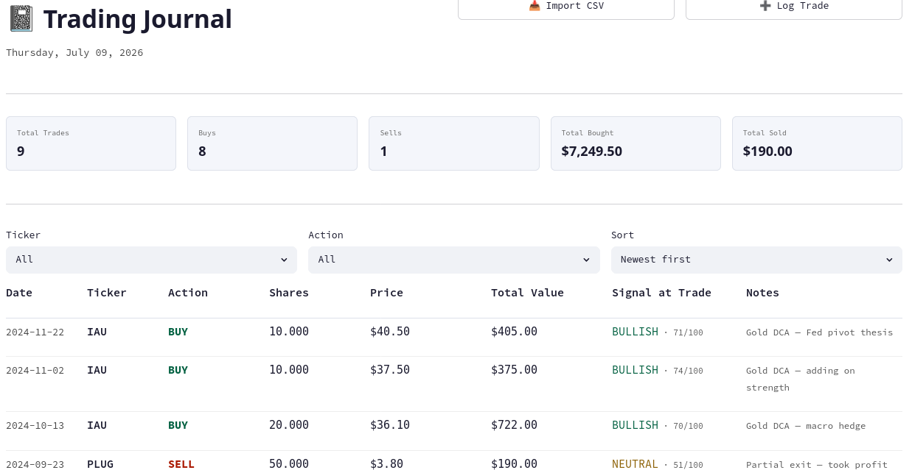
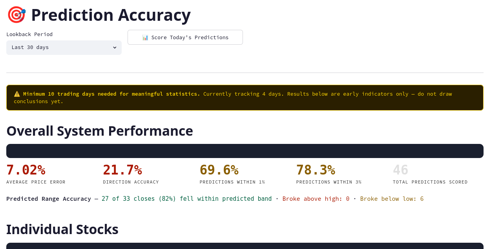
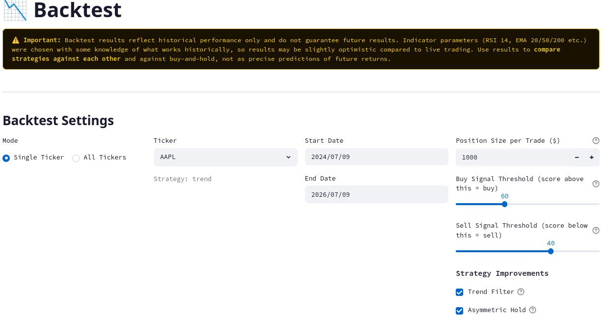

# 📈 Stock Screener 2.0

A full-stack equity research and portfolio management platform built entirely in Python. Combines real-time market data, macroeconomic indicators, NLP sentiment analysis, and XGBoost machine learning into a multi-page interactive dashboard.

**[🎯 Live Demo →](https://your-streamlit-url.streamlit.app)** &nbsp;|&nbsp; **[⬇ Download & Run Locally](#installation)**

> Demo mode is read-only. Changes reset when you close the tab. Download the full app for persistent portfolio tracking.

---

## Screenshots

### Home Dashboard


### Stock Detail


### ETF Screener


### Swing Trades


### Gold Dashboard


### Trading Assistant


### Portfolio


### Journal


### Accuracy


### Backtesting


---

## What It Does

**10 pages, one unified platform:**

| Page | Description |
|------|-------------|
| 🏠 Home | Market overview, top signals, quick-access page cards with live data |
| 📈 Stock Detail | Candlestick chart, technical indicators, ML prediction, sentiment, news |
| 📊 ETF Screener | Macro-driven ETF signals using FRED data + momentum analysis |
| ⚡ Swing Trades | Swing watchlist with 5-point entry checklist and pre-market prices |
| 🥇 Gold Dashboard | IAU position tracking, swing signals, macro hold analysis |
| 🎯 Trading Assistant | Entry/exit analyzer, ATR-based trade calculator, exit checklist |
| 💼 Portfolio | P&L tracker, allocation chart, position suggestions, account value |
| 📓 Journal | Auto trade log, Fidelity CSV import, manual entry, CSV export |
| 🎲 Accuracy | Prediction scoring, direction accuracy, per-ticker breakdown |
| 📉 Backtesting | Strategy vs buy-and-hold comparison, configurable parameters |

---

## Tech Stack

| Layer | Technology |
|-------|-----------|
| **Language** | Python 3.12 |
| **Dashboard** | Streamlit |
| **Charts** | Plotly |
| **Data** | yfinance, FRED API, NewsAPI |
| **Indicators** | pandas-ta (RSI, MACD, BB, ATR, EMA, Williams %R, Z-Score, OBV) |
| **ML Model** | XGBoost (price regression + direction classification) |
| **Sentiment** | FinBERT via HuggingFace Transformers |
| **Database** | SQLite |
| **Data Layer** | pandas, numpy |

---

## Architecture

```
stock_screener_2.0/
│
├── dashboard.py              # Home page
├── pages/                    # 9 additional pages
│   ├── 1_Stock_Detail.py
│   ├── 2_ETF_Screener.py
│   ├── 3_Swing_Trades.py
│   ├── 4_Gold_Dashboard.py
│   ├── 5_Trading_Assistant.py
│   ├── 6_Portfolio.py
│   ├── 7_Journal.py
│   ├── 8_Accuracy.py
│   └── 9_Backtest.py
│
├── core/                     # Shared layer — imported by all pages
│   ├── db_queries.py         # All DB reads in one place
│   ├── page_setup.py         # Nav, CSS, footer — one call per page
│   └── refresh.py            # Data pipeline (fetch → indicators → predict)
│
├── engine/                   # Data & analytics engine
│   ├── db.py                 # SQLite connection and schema
│   ├── fetcher.py            # yfinance OHLCV + fundamentals
│   ├── indicators.py         # Technical indicator computation
│   ├── predictor.py          # Composite signal (technical + fundamental + sentiment)
│   ├── ml_predictor.py       # XGBoost model training and inference
│   ├── sentiment.py          # FinBERT + NewsAPI + StockTwits
│   ├── strategy_advisor.py   # Rule-based strategy assignment
│   ├── backtester.py         # Historical strategy backtesting
│   ├── accuracy.py           # Prediction scoring and accuracy tracking
│   ├── etf_signals.py        # Macro-driven ETF signal computation
│   ├── gold_signals.py       # Gold-specific position and signal logic
│   └── prices.py             # Pre/after-hours price fetching
│
├── config.py                 # Central configuration (API keys, paths, params)
├── utils.py                  # Shared CSS design system, color tokens, helpers
├── run.py                    # CLI pipeline (refresh, train, predict, nightly)
│
├── demo_screener.db          # Sanitized demo database
├── demo_db.py                # Script to regenerate demo database
├── requirements.txt
└── launch.sh / stop.sh       # App lifecycle scripts
```

---

## Data Pipeline

```
yfinance ──→ price_history ──→ indicators ──→ predictor ──→ predictions
                                                ↑
NewsAPI + StockTwits ──→ FinBERT ──→ sentiment ┤
                                                ↑
yfinance fundamentals ──→ fundamentals ─────────┘
                                                ↓
XGBoost model ──→ blended signal ──→ composite score (0–100)
```

---

## Installation

### Prerequisites
- Python 3.10+
- Git

### Linux / macOS

```bash
git clone https://github.com/OubaiRif/stock-screener-2.0.git
cd stock-screener-2.0
bash setup.sh
bash launch.sh
```

### Windows

```bat
git clone https://github.com/OubaiRif/stock-screener-2.0.git
cd stock-screener-2.0
setup_windows.bat
```

### Manual setup (any OS)

```bash
git clone https://github.com/OubaiRif/stock-screener-2.0.git
cd stock-screener-2.0
python3 -m venv venv
source venv/bin/activate        # Windows: venv\Scripts\activate
pip install -r requirements.txt
python3 run.py init
streamlit run dashboard.py
```

---

## Configuration

Edit `config.py` to set your API keys:

```python
# Free tier — 100 requests/day
NEWS_API_KEY = "your_newsapi_key"   # https://newsapi.org/register
```

All other data sources (yfinance, FRED, StockTwits) require no API key.

---

## First Run

After installation:

```bash
# Add tickers to watchlist
python3 run.py add AAPL MSFT SPY GLD

# Fetch data and run full pipeline
python3 run.py nightly

# Launch the app
bash launch.sh
```

Then open [http://localhost:8501](http://localhost:8501) in your browser.

---

## Nightly Automation (Linux/macOS)

```bash
bash setup_cron.sh
```

Schedules `python3 run.py nightly` at 6PM daily to refresh data, retrain models, and generate predictions after market close.

---

## Demo Mode

To run in demo mode (read-only, session-based):

```bash
DEMO_MODE=true streamlit run dashboard.py
```

Uses `demo_screener.db` with sample data. All writes are session-only and reset on tab close.

---

## Skills Demonstrated

- **Data Engineering** — ETL pipeline from 5 data sources into a unified SQLite schema
- **Machine Learning** — XGBoost regression + classification with walk-forward validation
- **NLP** — FinBERT transformer model for financial sentiment analysis
- **Data Visualization** — 10-page interactive Plotly/Streamlit dashboard
- **Database Design** — 15-table normalized SQLite schema with migration tooling
- **API Integration** — yfinance, FRED, NewsAPI, StockTwits, timeapi.io
- **Software Architecture** — Modular design with shared core layer, no code duplication
- **Python** — pandas, numpy, scikit-learn, XGBoost, HuggingFace transformers

---

## Author

**Oubai Rifai**
- [GitHub](https://github.com/OubaiRif)
- [LinkedIn](https://www.linkedin.com/in/oubai-rifai/)

---

*For informational and educational purposes only. Not financial advice.*
