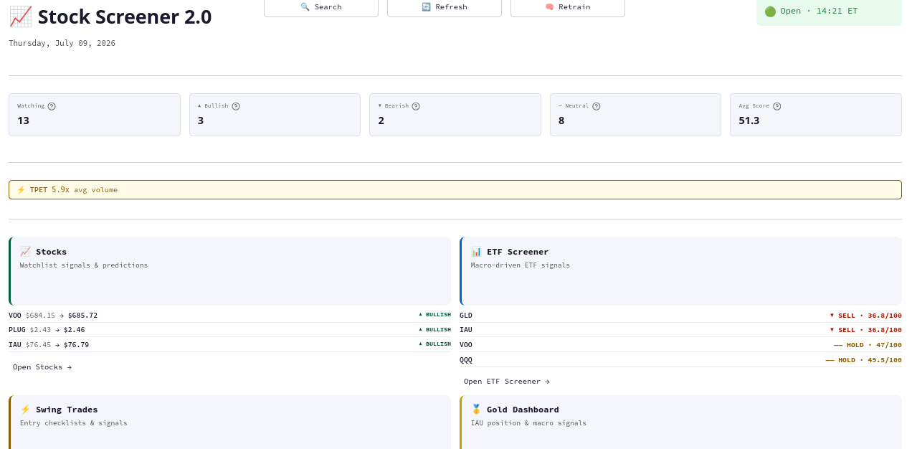
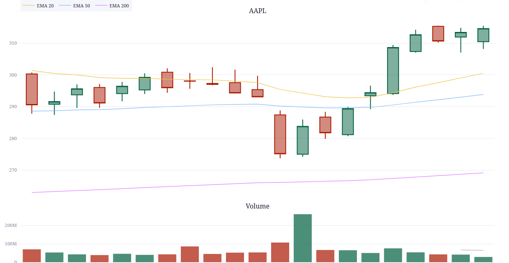
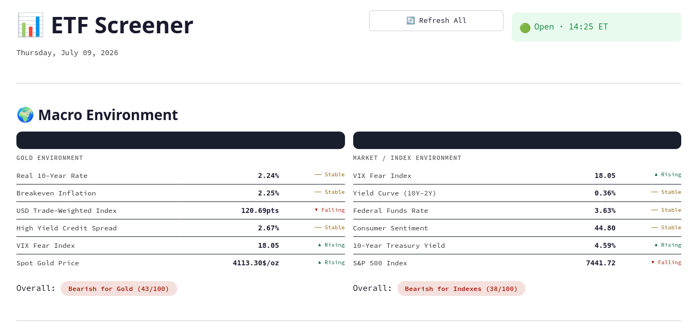
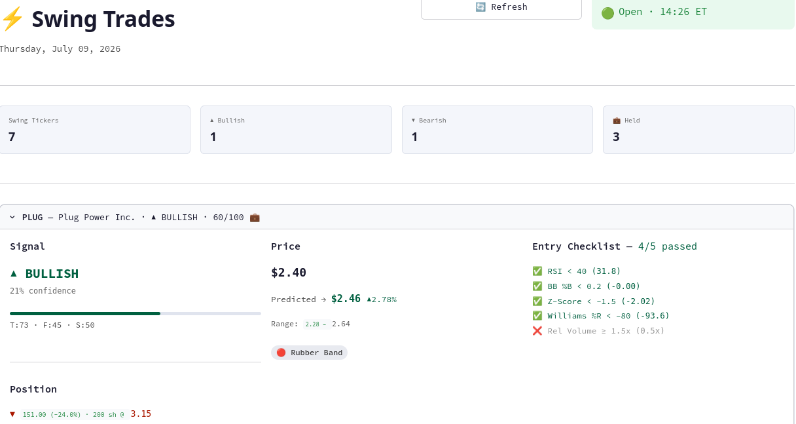
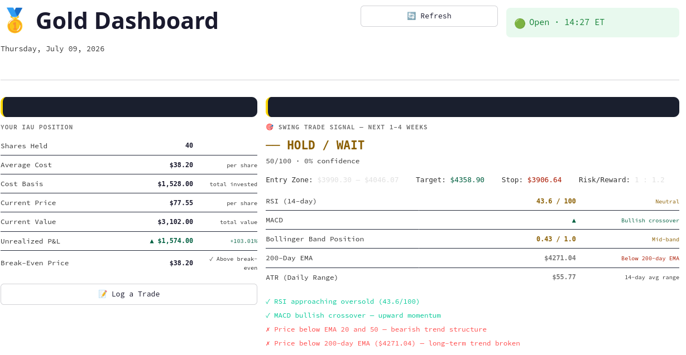
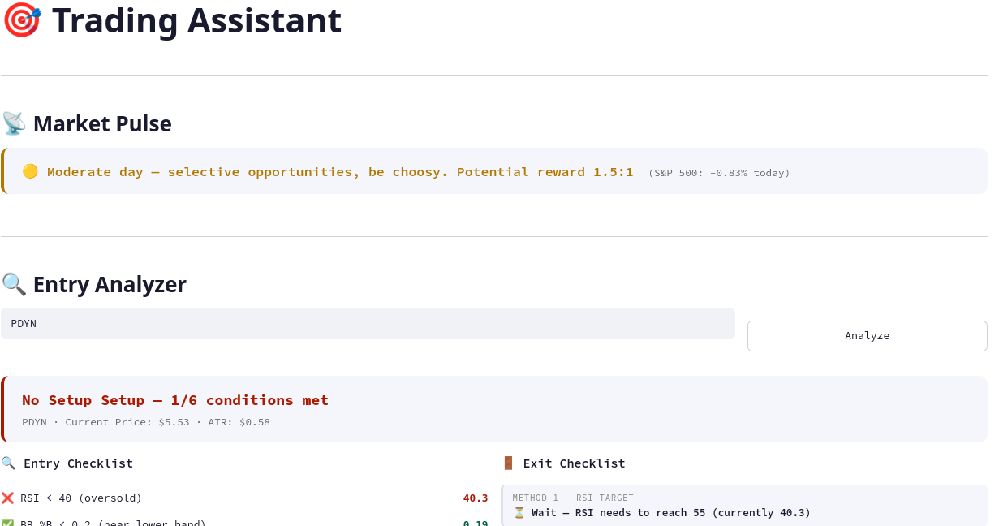
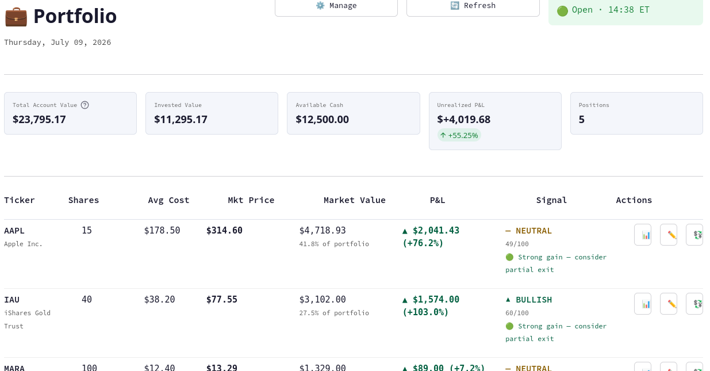
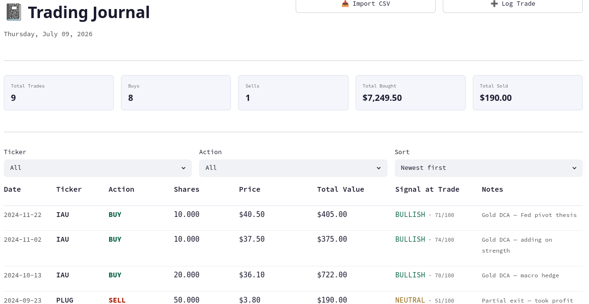
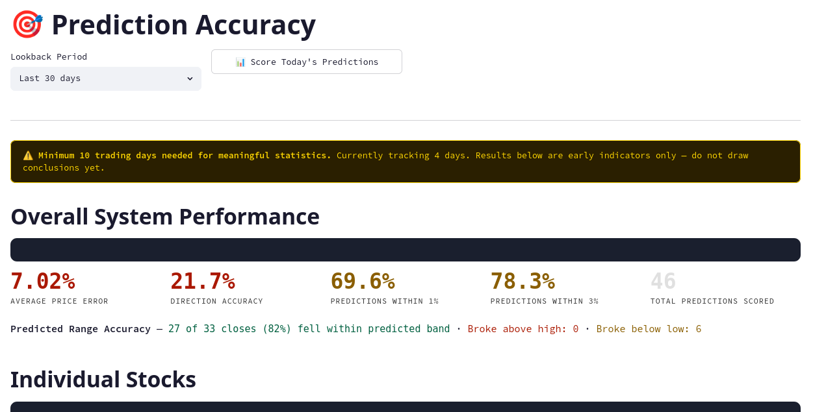
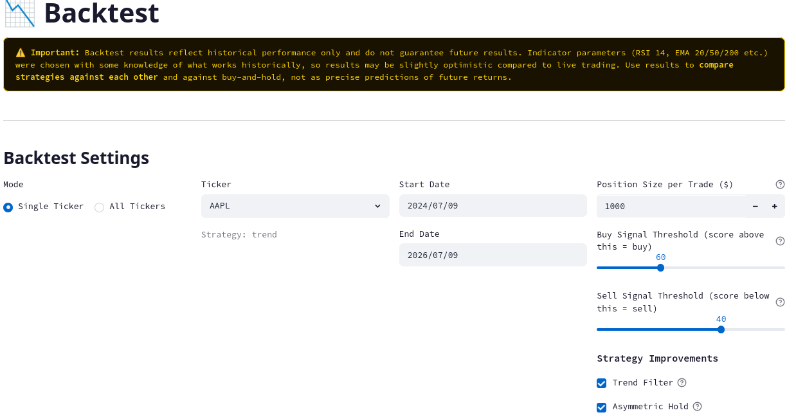

# 📈 Stock Screener 2.5

A full-stack equity research and portfolio management platform built entirely in Python. Combines real-time market data, macroeconomic indicators, NLP sentiment analysis, and XGBoost machine learning into a multi-page interactive dashboard.

**[🎯 Live Demo →](https://stock-screener-2.streamlit.app/)** &nbsp;|&nbsp; **[⬇ Download & Run Locally](#installation)**

> Demo mode is read-only and uses a sanitized sample database. Changes reset when you close the tab. Download the full app for persistent portfolio tracking with your own data.

---

## Screenshots

### Home Dashboard


### Stock Detail


### ETF Screener


### Swing Trades


### Gold Dashboard


### Trading Assistant


### Portfolio


### Journal


### Accuracy


### Backtesting


---

## What It Does

**10 pages, one unified platform:**

| Page | Description |
|------|-------------|
| 🏠 Home | Market overview, top signals, quick-access page cards with live data |
| 📈 Stock Detail | Candlestick chart, technical indicators, ML prediction, sentiment, news |
| 📊 ETF Screener | Macro-driven ETF signals using FRED data + momentum analysis |
| ⚡ Swing Trades | Swing watchlist with 5-point entry checklist and pre-market prices |
| 🥇 Gold Dashboard | IAU position tracking, swing signals, macro hold analysis |
| 🎯 Trading Assistant | Entry/exit analyzer, ATR-based trade calculator, exit checklist |
| 💼 Portfolio | P&L tracker, allocation chart, position suggestions, account value |
| 📓 Journal | Auto trade log, Fidelity CSV import, manual entry, CSV export |
| 🎲 Accuracy | Two-horizon prediction scoring, direction accuracy, per-ticker breakdown |
| 📉 Backtesting | Strategy vs buy-and-hold comparison, configurable parameters |

---

## Tech Stack

| Layer | Technology |
|-------|-----------|
| **Language** | Python 3.10+ (developed on 3.14) |
| **Dashboard** | Streamlit |
| **Charts** | Plotly |
| **Data** | yfinance, FRED data, NewsAPI (optional) |
| **Indicators** | `ta` (RSI, MACD, BB, ATR, EMA, Williams %R, Z-Score, OBV) |
| **ML Model** | XGBoost (price regression + direction classification), with regime filters and a naive-persistence baseline for comparison |
| **Sentiment** | FinBERT via HuggingFace Inference API (`huggingface_hub`) |
| **Calendar** | `pandas_market_calendars` — predictions and swing maturation keyed to real NYSE trading days, not calendar days |
| **Database** | SQLite |
| **Data Layer** | pandas, numpy, scikit-learn |

---

## Architecture

```
stock_screener_2.5/
│
├── dashboard.py              # Home page
├── pages/                    # 9 additional pages
│   ├── 1_Stock_Detail.py
│   ├── 2_ETF_Screener.py
│   ├── 3_Swing_Trades.py
│   ├── 4_Gold_Dashboard.py
│   ├── 5_Trading_Assistant.py
│   ├── 6_Portfolio.py
│   ├── 7_Journal.py
│   ├── 8_Accuracy.py
│   └── 9_Backtest.py
│
├── core/                     # Shared layer — imported by all pages
│   ├── db_queries.py         # All DB reads in one place
│   ├── page_setup.py         # Nav, CSS, footer — one call per page
│   └── refresh.py            # Data pipeline (fetch → indicators → predict)
│
├── engine/                   # Data & analytics engine
│   ├── db.py                 # SQLite connection and schema
│   ├── fetcher.py            # yfinance OHLCV + fundamentals
│   ├── indicators.py         # Technical indicator computation (`ta` library)
│   ├── calendar_utils.py     # NYSE trading-day calendar (vs. calendar-day) arithmetic
│   ├── predictor.py          # Composite signal (technical + fundamental + sentiment)
│   ├── ml_predictor.py       # XGBoost model training and inference, with regime filters
│   ├── sentiment.py          # FinBERT (HF Inference API) + NewsAPI + StockTwits
│   ├── strategy_advisor.py   # Rule-based strategy assignment
│   ├── backtester.py         # Historical strategy backtesting
│   ├── accuracy.py           # Two-horizon prediction scoring and accuracy tracking
│   ├── etf_signals.py        # Macro-driven ETF signal computation
│   ├── gold_signals.py       # Gold-specific position and signal logic
│   └── prices.py             # Pre/after-hours price fetching
│
├── tools/
│   └── debug.py
│
├── config.py                 # Central configuration (API keys, paths, params)
├── utils.py                  # Shared CSS design system, color tokens, helpers
├── run.py                    # CLI pipeline (refresh, train, predict, nightly)
│
├── demo_screener.db          # Sanitized demo database
├── demo_db.py                # Script to regenerate demo database
├── requirements.txt
└── launch.sh / stop.sh       # App lifecycle scripts
```

---

## Data Pipeline

```
yfinance ──→ price_history ──→ indicators ──→ predictor ──→ predictions
                                                ↑
NewsAPI + StockTwits ──→ FinBERT ──→ sentiment ┤
                                                ↑
yfinance fundamentals ──→ fundamentals ─────────┘
                                                ↓
XGBoost model (regime-filtered) ──→ blended signal ──→ composite score (0–100)
```

Predictions and swing-trade maturation are evaluated against the real NYSE trading calendar (`calendar_utils.py`), not plain calendar-day arithmetic.

---

## Installation

### Prerequisites
- Python 3.10+
- Git

### Manual setup (all platforms)

```bash
git clone -b stock-screener-2.5 https://github.com/OubaiRif/stock_screener_2.0.git
cd stock_screener_2.0
python3 -m venv venv
source venv/bin/activate        # Windows: venv\Scripts\activate
pip install -r requirements.txt
cp .env.example .env            # then add your HuggingFace key (see Configuration)
python3 run.py init
streamlit run dashboard.py
```

Then open [http://localhost:8501](http://localhost:8501) in your browser.

### Linux / macOS (scripted)

```bash
git clone -b stock-screener-2.5 https://github.com/OubaiRif/stock_screener_2.0.git
cd stock_screener_2.0
bash setup.sh
bash launch.sh
```

---

## Configuration

Copy `.env.example` to `.env` and fill in:

```bash
HF_API_KEY=your_huggingface_api_key_here
```

Get a free key at [huggingface.co/settings/tokens](https://huggingface.co/settings/tokens). This powers FinBERT sentiment via the HuggingFace Inference API — without it, sentiment analysis silently falls back to a simpler keyword-based method.

Optional, in `config.py`:
```python
NEWS_API_KEY = "your_newsapi_key"   # https://newsapi.org/register — free tier, 100 requests/day
```
All other data sources (yfinance, FRED, StockTwits) require no API key.

---

## First Run

```bash
# Add tickers to watchlist
python3 run.py add AAPL MSFT SPY GLD

# Fetch data and run full pipeline
python3 run.py nightly

# Launch the app
bash launch.sh
```

---

## Nightly Automation

The pipeline (`python3 run.py nightly`) is meant to run once per trading day, after NYSE close, to refresh data, retrain models, and generate predictions.

**Option A — cron (Linux/macOS):**
```bash
bash setup_cron.sh
```
Installs a cron job at 21:15 UTC (safely after the 21:00 UTC / 4PM ET close), Mon–Fri, regardless of your local timezone.

**Option B — systemd user timer (Linux):** more robust for a machine that sleeps/suspends irregularly, since systemd catches up missed runs. Not included as a script here — ask if you want a template unit file.

---

## Demo Mode

To run in demo mode (read-only, session-based):

```bash
DEMO_MODE=true streamlit run dashboard.py
```

Uses `demo_screener.db` with sample data. All writes are session-only and reset on tab close. For a Streamlit Cloud deployment, set `DEMO_MODE = true` in `.streamlit/secrets.toml` instead.

---

## Skills Demonstrated

- **Data Engineering** — ETL pipeline from multiple data sources into a unified SQLite schema
- **Machine Learning** — XGBoost regression + classification with regime filters and a naive-persistence baseline for honest comparison
- **NLP** — FinBERT sentiment analysis via HuggingFace Inference API
- **Data Visualization** — 10-page interactive Plotly/Streamlit dashboard
- **Database Design** — Normalized SQLite schema with migration tooling
- **Calendar-Aware Time Series** — NYSE trading-day arithmetic for predictions and swing maturation, not naive calendar-day math
- **API Integration** — yfinance, FRED, NewsAPI, StockTwits, HuggingFace
- **Software Architecture** — Modular design with a shared core layer, no code duplication
- **Python** — pandas, numpy, scikit-learn, XGBoost, HuggingFace Hub

---

## Author

**Oubai Rifai**
- [GitHub](https://github.com/OubaiRif)
- [LinkedIn](https://www.linkedin.com/in/oubai-rifai/)

---

*For informational and educational purposes only. Not financial advice.*
